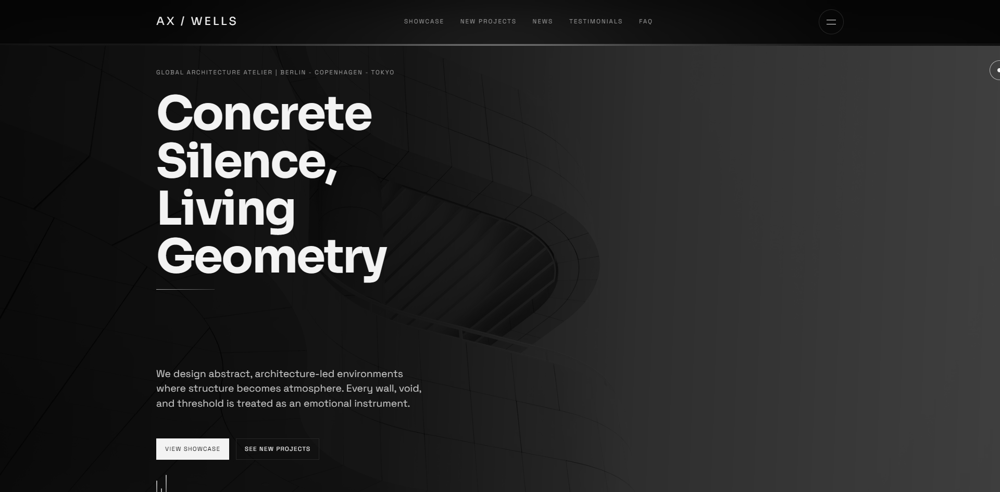
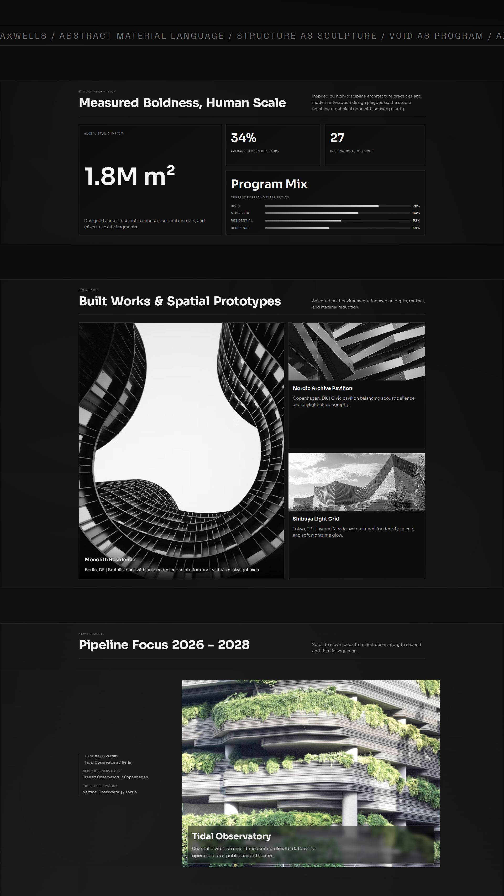
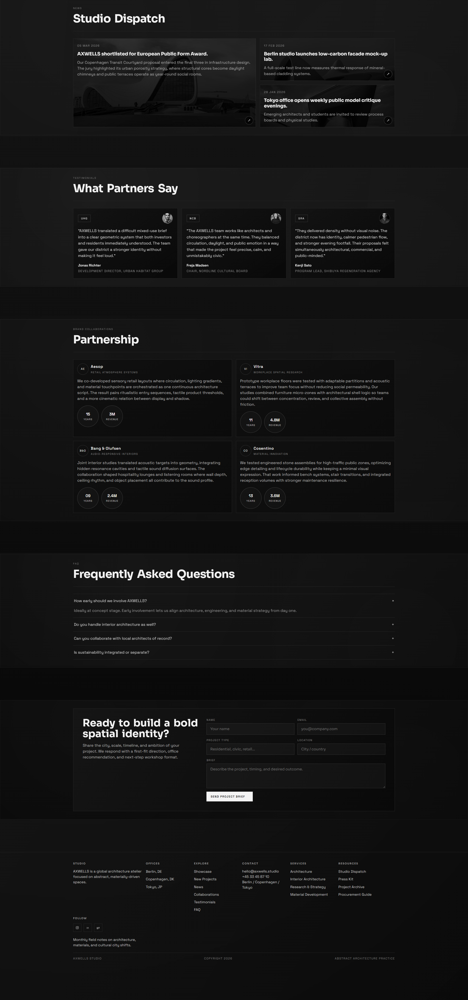

# AXWELLS

**Abstract Architecture Studio — Berlin · Copenhagen · Tokyo**

A modern premium landing page for AXWELLS, a global architecture atelier focused on abstract, materially-driven spaces and human-scale environments.

The interface blends strong editorial typography, cinematic section transitions, and high-detail motion interactions to communicate both technical rigour and spatial sensibility.

The experience is designed to feel immersive and architectural while remaining fully responsive and usable across desktop and mobile.

---

## Development Approach

This project was built with an AI-assisted workflow using GitHub Copilot inside VS Code, enabling rapid iteration on:

- smooth scrolling behaviour and transition timing with **Lenis**
- modular section architecture across a multi-page structure
- scroll-driven animation choreography using **IntersectionObserver** and **requestAnimationFrame**
- interaction patterns including expandable dispatch cards, scrollytelling pipeline focus, and custom cursor behaviour
- staged page-load entrance sequences with progressive reveal motion

The process prioritised speed without sacrificing design clarity, code readability, or maintainability.

---

## Visual Design & Theme

The visual language uses a strict monochrome palette — deep blacks, layered grays, and soft white highlights — with high-contrast typography and carefully structured negative space.

The theme direction emphasises:

- abstract architectural minimalism
- premium editorial spacing and asymmetric layout grids
- tactile, material-driven tone inspired by high-discipline architecture practices

Subtle ambient glow layers, scroll-reactive gradients, and restrained motion cues guide attention without overwhelming content.

---

## Hero Section

The landing hero establishes the studio identity immediately with a full-bleed architectural background and cinematic headline.

It includes:

- a typographic wave animation on the primary heading
- focused studio positioning statement
- conversion-oriented call-to-action buttons
- animated load entrance with blur dissolve and staged panel reveal
- ambient motion bars that pulse and shift with scroll progress

---

## Experience Structure

The page is organised into reusable narrative modules that scale as the studio story grows:

- **Studio Information** — animated metric counters and scroll-triggered program mix bar animations
- **Built Showcase** — grayscale-to-colour hover grid with major/minor card layout
- **Pipeline Focus** — scrollytelling sequence stepping through three upcoming observatory projects
- **Studio Dispatch** — expandable news cards with background imagery and animated reveal
- **What Partners Say** — testimonial grid with avatar, brand tag, and hover depth transitions
- **Partnership** — static expanded partner cards with achievement metric tags
- **FAQ** — single-open accordion with smooth height animation
- **Contact** — project brief form with form-engagement-triggered send button state
- **Footer** — structured studio index with office links, services, and social chips

---

## Motion & Interaction Highlights

- Lenis-powered smooth scrolling with tuned easing and wheel multiplier
- Staged page-load motion: header, rails, and hero panel dissolve in sequentially
- Wave text animation per word group with staggered character delays
- Scroll-triggered Studio Information metric count-up and bar fill animations
- 3D hero panel transform (perspective + rotateX + scale) driven by scroll progress
- Pipeline scrollytelling with focus/depth CSS variables per slide
- Section ambient movement — subtle background drift and glow responding to scroll position
- Dispatch card expand/collapse with single-open logic
- Custom cursor with ring tracking and interactive hover state
- Fixed section progress rail and social links that fade as the hero scrolls away
- Form engagement state — `SENDING` label appears only after a form field is focused

---

## Office Subpages

Individual pages for each studio location, sharing the same visual and motion system:

- `berlin.html` — Berlin Atelier
- `copenhagen.html` — Copenhagen Atelier
- `tokyo.html` — Tokyo Atelier

---

## Tech Stack

- **HTML5** — semantic multi-page structure
- **CSS3** — custom properties, grid layouts, keyframe and transition system
- **JavaScript** (vanilla) — modular IIFE init pattern, IntersectionObserver, RAF-based counters
- **Lenis** — smooth scroll (installed locally via npm)
- **Google Fonts** — Sora · Space Grotesk

---

## Live Preview

[https://denysovski.github.io/AxwellProjection/](https://denysovski.github.io/AxwellProjection/)

---

## Repository Files

| File | Description |
|------|-------------|
| `index.html` | Main landing page |
| `berlin.html` | Berlin office subpage |
| `copenhagen.html` | Copenhagen office subpage |
| `tokyo.html` | Tokyo office subpage |
| `styles.css` | Shared design and motion system |
| `script.js` | Central interaction and animation controller |
| `package.json` | npm dependency manifest (Lenis) |

---

## Issue Images

